# slanplot (科研级可视化工具包)


`slanplot` 是一款高级且极具美感的 Python 数据可视化库。它复刻并致敬了由 *slandarer* 创作的顶级 MATLAB 科研绘图系列，旨在打破 MATLAB 与 Python 之间的视觉壁垒，让 Python 的数据科学及学术科研生态同样能够轻松生成具有极致审美、符合顶级期刊出版标准的绝美图表。

## ✨ 核心特性

- **极致美学设计**: 完美传承原版设计的颜色域和设计哲学。系统内嵌 **53 款** 专为科研深度定制的顶级 `slanColor` 颜色映射表，在初始化时自动无缝注入到 Matplotlib 的全局色卡池中。
- **开箱即用的高阶图表**: 不需要数百行的复杂 Matplotlib/Seaborn 拼凑逻辑，只需极简的面向对象 API 调用。
- **纯正科学风格**: 自带论文级别的版式设计（自动消隐无效坐标轴、自适应显著性标量星号 `***`，等比例图表无缝镶嵌及白底高对比度模式）。

## 📦 快速安装

可以通过 pip 从 PyPI 直接一键安装 `slanplot` 及其所有绘图依赖包：

```bash
pip install slanplot
```

## 📊 图表画廊 (Gallery)

`slanplot` 为您精心打磨了涵盖**分布型**与**关系/拓扑型**领域的十余种进阶可视化方案。

### 分布型图表 (Distribution Plots)

| 图表名称 | 示例演示 | 简介 |
| :---: | :---: | :--- |
| **MarginalPlot** <br> (边缘联合误差分布图) | 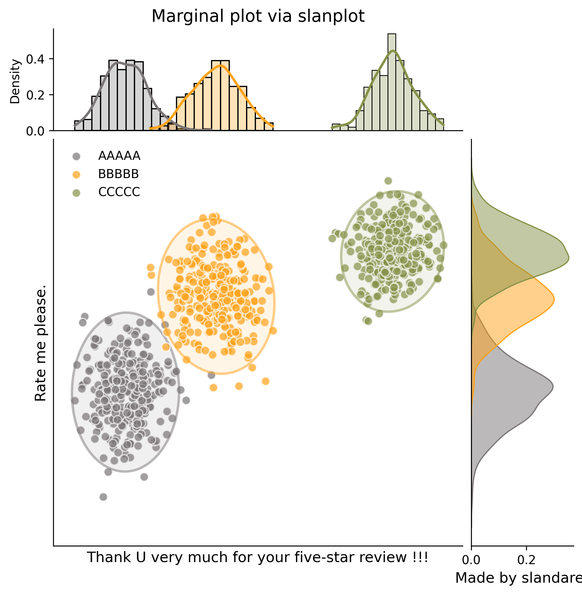 | 带密度地毯条带 (`rug`) 或 概率密度 (`kde`) 边缘映射的强对比度散点误差图。 |
| **SHeatmap** <br> (特种相关矩阵热力图) | 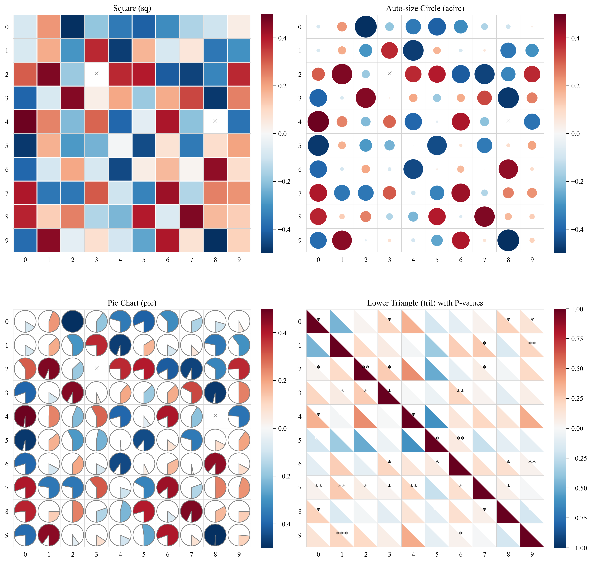 | 远超常规热力图，支持按照数据大小自适应扇形、六边形，以及显著性 `***` 阵列。 |
| **JoyPlot** <br> (峰峦图) | 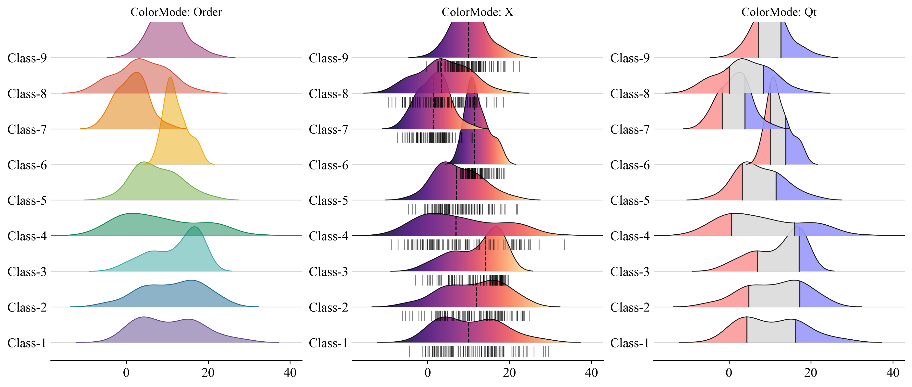 | 极简风格重叠密度波浪图，附带底部专属对齐基线，展现多组数据趋势演变。 |
| **HatchedBar** <br> (经典阴影网格柱状图) | 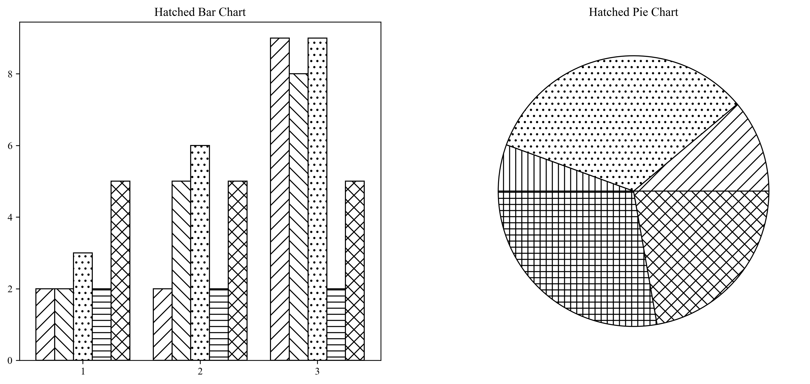 | 原汁原味的黑白或强对比网格填充（Bar & Pie），专为非彩印学术期刊设计。 |
| **VennDiagram** <br> (三相贝塞尔维恩图) | 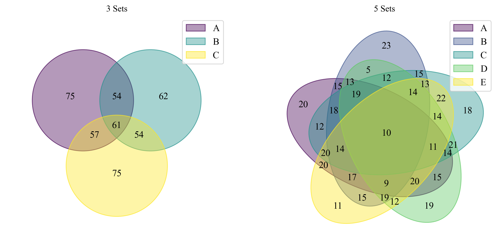 | 基于完美贝塞尔曲线控制点的平滑异形维恩图，颠覆传统圆圈相交视觉。 |
| **UpSet Plot** <br> (多集合交集图) | 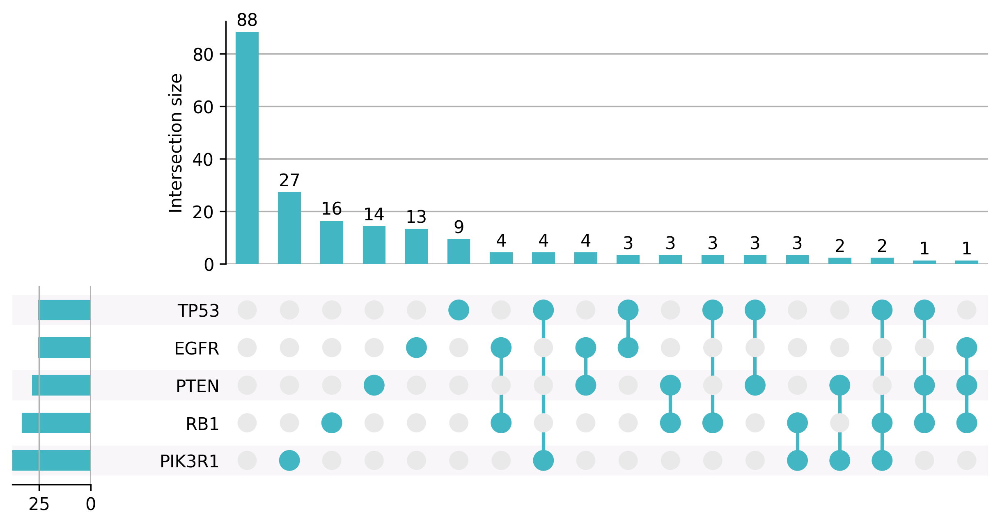 | 针对超过 3 个集合时的复杂交集排布，采用优雅的矩阵散点连线配合边缘直方图展示。 |
| **CalendarHeatmap** <br> (日历热力图) | 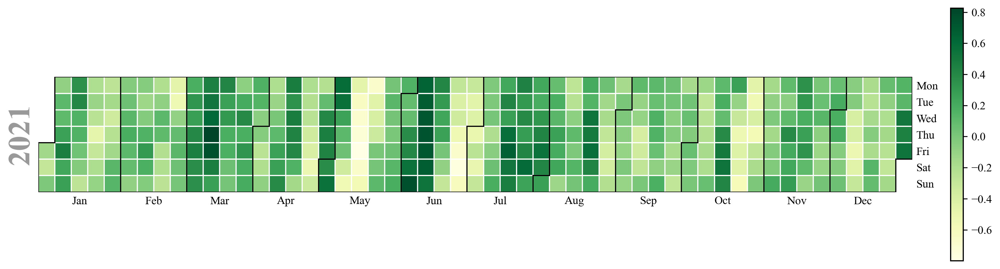 | 类似 GitHub Commits 的按年月网格排布的热力面板。 |

### 关系型与树状拓扑 (Relational & Tree Plots)

| 图表名称 | 示例演示 | 简介 |
| :---: | :---: | :--- |
| **Sankey Diagram** <br> (多级桑基图) | 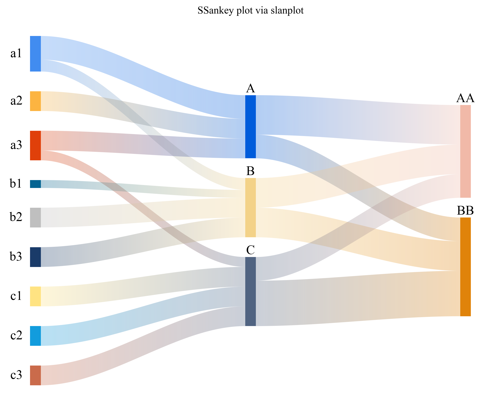 | 全自动物理引力排版与层级对齐，多阶段流量分配完美无缝连接与色彩渐变过渡。 |
| **Chord Diagram** <br> (和弦图) | 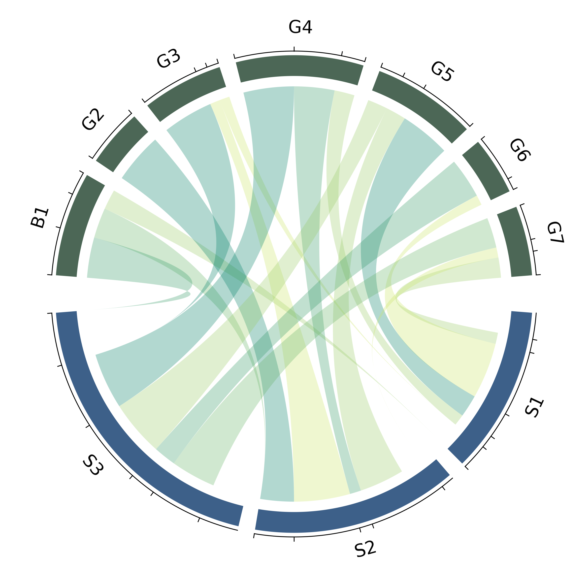 | 展示基因或要素间相互流入流出权重关系的最强图表，高度仿照经典极坐标构型。 |
| **STree** <br> (系统发生层级树) | 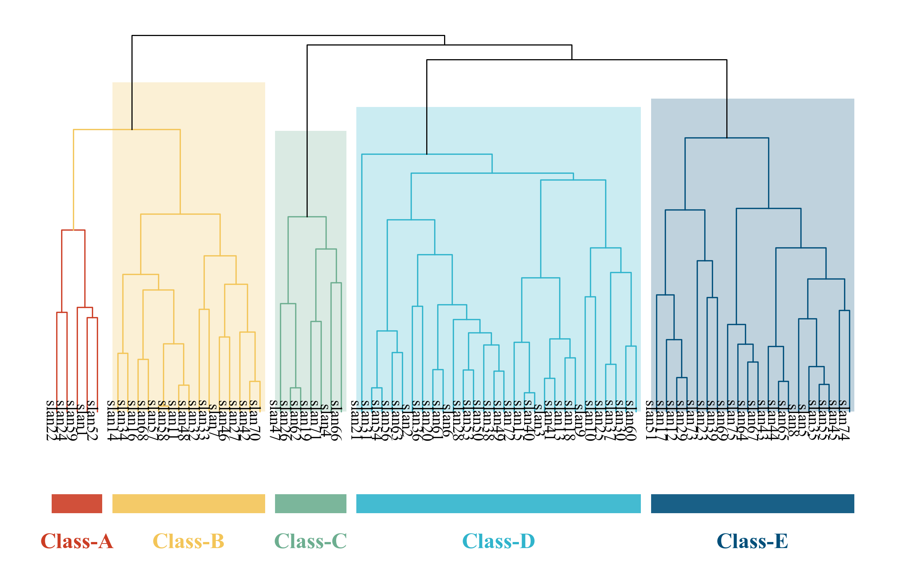 | 支持右侧挂载额外分类色块或热力分布的多层系统树。 |
| **Circular Tree** <br> (环状发射树图) |  | 由内向外放射的树状分形结构图，完美适配各类物种、文件目录的层级分布。 |
| **PiTree** <br> (折角发射树图) | 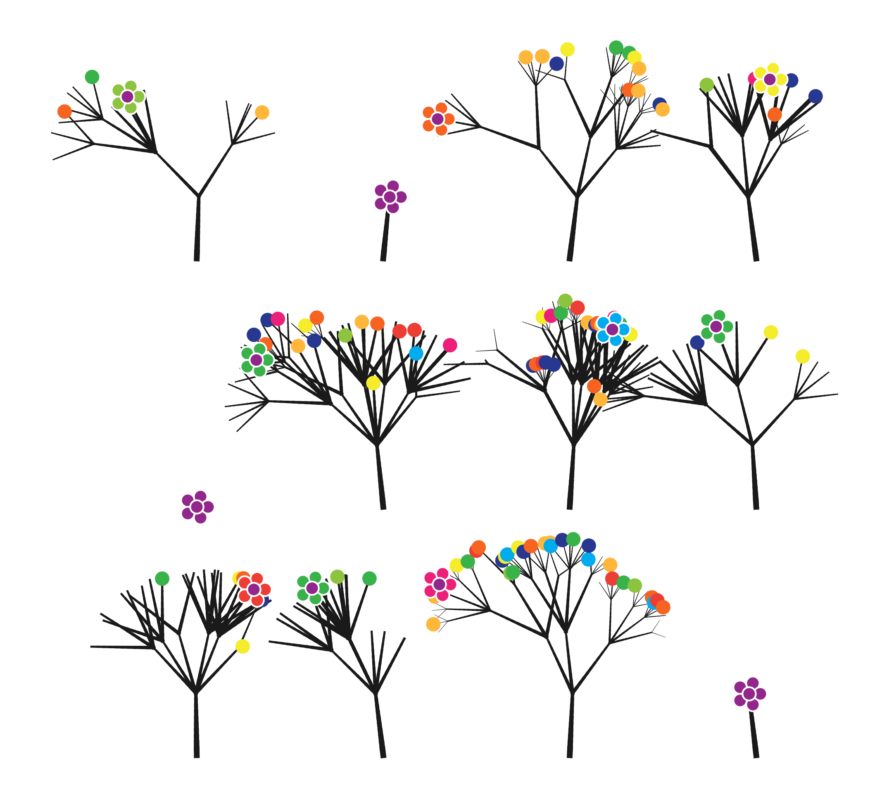 | 在圆极坐标系下采用折线直角连接，带来更严谨硬核的数据归属层级表现。 |


## 🚀 极简用法示例

以绘制一张引人注目的**系统发射树 (Circular Tree)** 为例：

```python
import numpy as np
import matplotlib.pyplot as plt
from slanplot import CircularTree

# 1. 模拟层级路径数据
data = np.random.randint(1, 4, (100, 4)) 
# (四层结构，每层含多种分类节点)

# 2. 一键调用，优雅绘图
fig, ax = plt.subplots(figsize=(10, 10))
ct = CircularTree(data, ax=ax, cmap='slan_batlow')
ct.draw()

plt.show()
```

## 📖 互动式文档与教程

我们在 `examples/notebooks/` 目录下准备了极其详尽的沉浸式 Jupyter 交互教程。克隆本仓库后即可直接启动并交互式体验：

1. `01_Relational_Plots.ipynb`: 带您玩转 桑基图 (Sankey)、和弦图 (Chord) 以及各类系统发生树 (STree 等)。
2. `02_Distribution_Plots.ipynb`: 带您玩转 特种热力图 (SHeatmap)、峰峦图 (Joyplot)、维恩图 (Venn) 及各类误差面板图。
3. `03_Scientific_Visualization.ipynb`: **进阶挑战！** 一步步教您如何像顶级生物医学杂志那样拼装含有复杂坐标轴映射及统计边界图的超级科研绘图板。

## 🤝 参与贡献

欢迎通过 Issues 提交反馈或提出任何 MATLAB `slandarer` 原版绘图中尚未被移植的精品功能期待。通过 Pull Request 提交的代码贡献更是不胜感激！

## 📜 许可证 (License)

本项目采用 MIT License 开源，详见 [LICENSE](./LICENSE) 文件。
